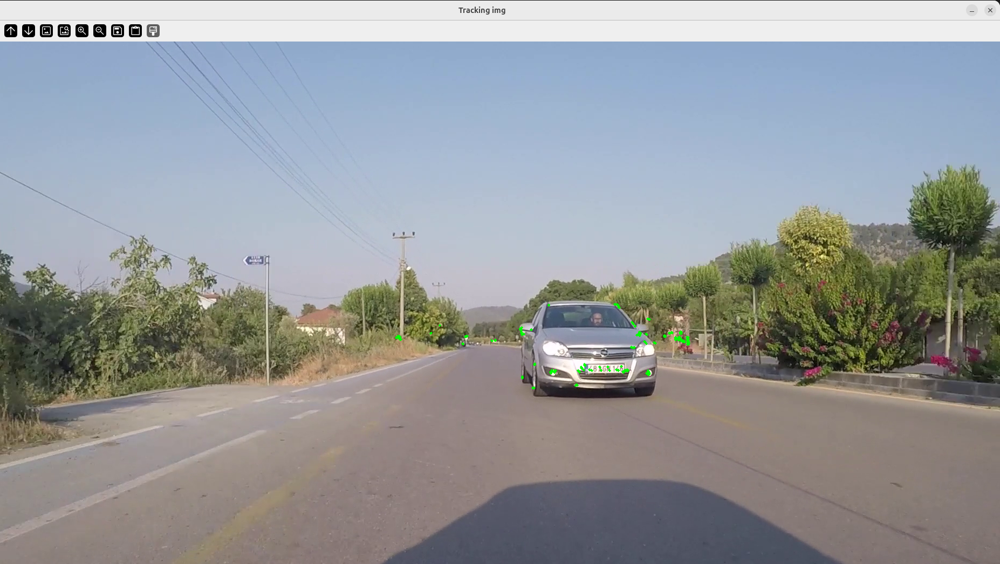
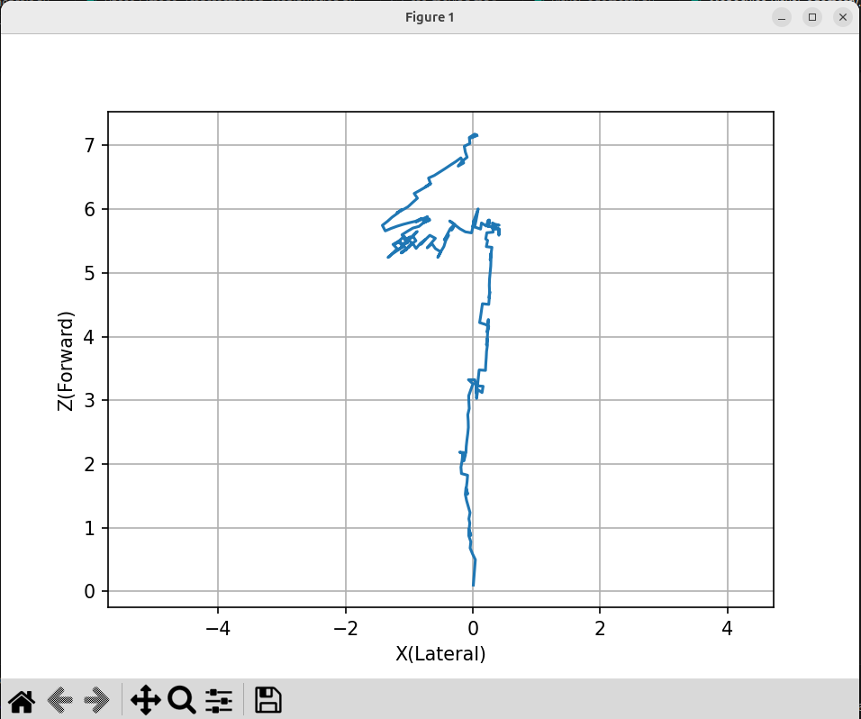

# Results

This folder contains the qualitative results of the Monocular Visual Odometry pipeline.

## 1. Feature Tracking
The image below shows ORB feature detection and Lucas–Kanade optical flow tracking across frames.

## 2. Estimated Camera Trajectory
The plot below shows the estimated camera trajectory in the X–Z plane (lateral vs forward motion).

## Notes
- The trajectory is **up-to-scale** (monocular VO limitation).
- No ground truth alignment is performed.
